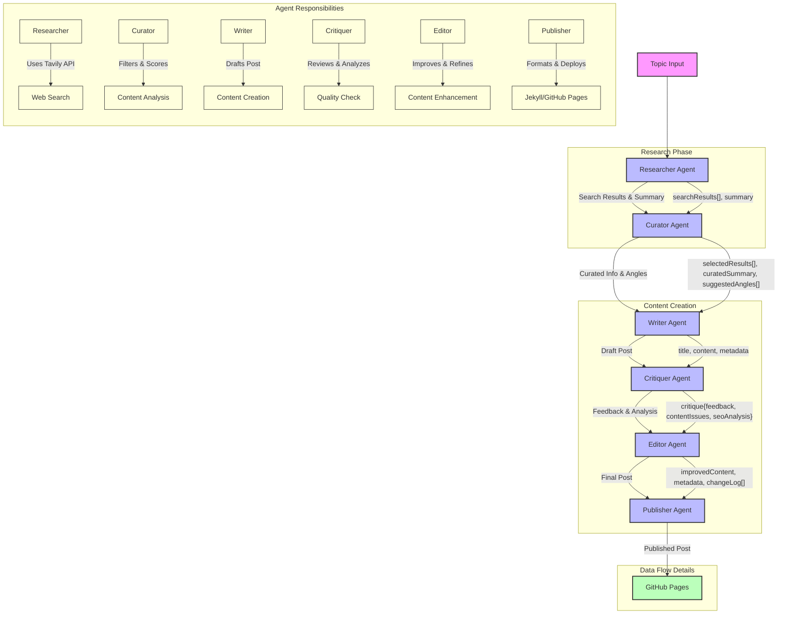

# Multi-Agent Blog Generator

A multi-agent system built with [LangChain](https://github.com/hwchase17/langchain), [LangGraph](https://github.com/jetpack-io/langgraph), TypeScript, and OpenAI to automatically research, curate, write, critique, and publish blog posts.

## Table of Contents

1. [Overview](#overview)  
2. [Project Structure](#project-structure)  
3. [Agents and Their Roles](#agents-and-their-roles)  
4. [Setup and Installation](#setup-and-installation)  
5. [Configuration](#configuration)  
6. [Running the Project](#running-the-project)  
7. [Usage Flow](#usage-flow)  
8. [Contributing](#contributing)  
9. [Future Improvements](#future-improvements)  
10. [License](#license)

---

## Overview

This project aims to streamline the blog creation process using a network of specialized AI agents. Each agent has a distinct responsibility:

1. **Researcher** – Gathers information about a topic.  
2. **Curator** – Filters and selects the most relevant pieces of information.  
3. **Writer** – Drafts a coherent blog post based on the curated research.  
4. **Critiquer** – Reviews the draft and suggests improvements.  
5. **Editor** – Applies the critiques to refine the blog post.  
6. **Publisher** – Finalizes and uploads the post to a target platform (or outputs the final copy).

By combining [LangChain](https://github.com/hwchase17/langchain) for prompt chaining and advanced LLM operations, [LangGraph](https://github.com/jetpack-io/langgraph) for agent orchestration, and TypeScript for structured development, this system showcases a powerful approach to automated content generation.

---

## Project Structure

```bash
.
├── src
│   ├── agents
│   │   ├── researcherAgent.ts
│   │   ├── curatorAgent.ts          (planned)
│   │   ├── writerAgent.ts           (planned)
│   │   ├── critiquerAgent.ts        (planned)
│   │   ├── editorAgent.ts           (planned)
│   │   └── publisherAgent.ts        (planned)
│   └── network
│       └── graph.ts
├── package.json
├── tsconfig.json
├── .env (ignored in .gitignore)
└── project-guide.md


- **`src/agents/`**  
  Contains specialized agent implementations for research, curation, writing, critique, editing, and publishing.

- **`src/network/`**  
  Contains infrastructure for orchestrating agent communication, likely leveraging [LangGraph](https://github.com/jetpack-io/langgraph).

- **`package.json`**  
  Contains dependencies and npm scripts.

- **`tsconfig.json`**  
  TypeScript configuration for compilation.

- **`.env`**  
  Contains environment variables (e.g., API keys) that should **not** be committed to version control.

---

## Agents and Their Roles

1. **Researcher Agent (`researcherAgent.ts`)**  
   - Uses [Tavily](https://www.npmjs.com/package/tavily) to search a given topic.  
   - Summarizes the results with the help of an LLM (e.g., ChatGPT via the OpenAI API).  
   - Outputs structured research data to be consumed by other agents.

2. **Curator Agent (Planned)**  
   - Receives raw or summarized data from the Researcher.  
   - Selects the most relevant and high-quality pieces of information for the writer.

3. **Writer Agent (Planned)**  
   - Converts the curated information into an initial blog post draft.  
   - Uses prompts and structured templates (via LangChain) to ensure coherence and style.

4. **Critiquer Agent (Planned)**  
   - Reviews the draft blog post.  
   - Provides feedback or suggestions on structure, clarity, style, and accuracy.

5. **Editor Agent (Planned)**  
   - Accepts critique from the Critiquer agent.  
   - Integrates edits and finalizes the post content.

6. **Publisher Agent (Planned)**  
   - Receives the final draft.  
   - Publishes the post to a CMS or outputs it in a final format (markdown, HTML, etc.).

---

## Setup and Installation

This project can be run using either **npm** or **Bun**. Follow the steps below to install dependencies, configure the environment, and start the application.

### 1. Installing Dependencies

#### Using npm

```bash
# Clone the repository
git clone https://github.com/your-username/multi-agent-blog-generator.git
cd multi-agent-blog-generator

# Install dependencies with npm
npm install

### Using Bun

# Clone the repository
git clone https://github.com/your-username/multi-agent-blog-generator.git
cd multi-agent-blog-generator

# Install dependencies with Bun
bun install


## 2. Configuration

### Environment Variables

Create a `.env` file in the project root (it's already listed in `.gitignore`).

Add your OpenAI API Key and any other required keys or settings:

```bash
OPENAI_API_KEY=your-openai-api-key


## 3. Running the Project

### Using npm

# Compile TypeScript (optional step; you can also rely on ts-node if configured)
```bash
npm run build
```

# Start the project
```bash
npm run start
```


### Using Bun

# Compile TypeScript (optional step; you can also rely on ts-node if configured)
```bash
bun run build
```

# Start the project
```bash
bun run start
```

## Usage Flow

Below is the general flow of how the multi-agent system works. Some agents are still in development (marked as "planned").

### Researcher Agent
1. Receives a topic input (e.g., "AI-driven content creation").  
2. Searches for information (using [Tavily](https://www.npmjs.com/package/tavily) or another search API).  
3. Summarizes the findings using ChatGPT or another LLM.

### Curator Agent (Planned)
- Filters and selects the most relevant segments from the Researcher's summary.

### Writer Agent (Planned)
- Creates a coherent first draft of the blog post using the curated information.

### Critiquer Agent (Planned)
- Reviews the draft, suggesting improvements on clarity, style, and accuracy.

### Editor Agent (Planned)
- Integrates the Critiquer's feedback to finalize the content.

### Publisher Agent (Planned)
- Outputs or publishes the final, polished blog post (to a CMS, Markdown file, etc.).

## Agent Workflow



## Agent Details

1. **Researcher Agent**
   - Uses Tavily Search API
   - Gathers comprehensive information
   - Outputs: Search results and summary

2. **Curator Agent**
   - Filters relevant information
   - Scores content quality
   - Outputs: Selected results, summary, and angles

3. **Writer Agent**
   - Creates initial blog draft
   - Structures content
   - Outputs: Title, content, and metadata

4. **Critiquer Agent**
   - Reviews content quality
   - Analyzes SEO and structure
   - Outputs: Feedback, issues, and analysis

5. **Editor Agent**
   - Implements improvements
   - Refines writing style
   - Outputs: Enhanced content with changelog

6. **Publisher Agent**
   - Formats for Jekyll
   - Handles GitHub Pages deployment
   - Outputs: Published post with metadata


